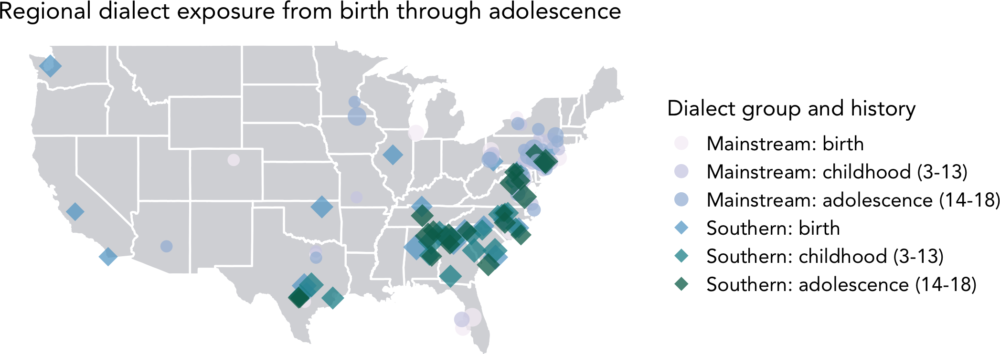

```{r setup, include=FALSE, message=FALSE, warning=FALSE}
## R setup ##

# knitr settings
# chooseCRANmirror(graphics=FALSE, ind=1)
knitr::opts_chunk$set(echo=FALSE, warning=FALSE, message=FALSE)
# knitr::knit_hooks$set(document = function(x) {sub('\\usepackage[]{color}', '\\usepackage{xcolor}', x, fixed = TRUE)})
```

```{r child = 'load_data.Rmd', message=FALSE, warning=FALSE}
```

# Background

- Variation across individuals, accents, and dialects is inherent to language
- Theories of language processing primarily draw on evidence from standard language varieties
- Syntactic processing research with EEG typically relies on written stimuli with grammatical violations or ambiguities
- Production-Distribution-Comprehension (PDC) model provides mechanistic account of relation between familiarity and processing in previous research on dialect <font size=5>[@macdonald2013]</font>
- **Double modals**: "socially diagnostic" Southern dialect feature signaling indirectness or hedging <font size=5>[@hasty2012; @mishoe1994; @bernstein2003]</font>

# Stimuli

```{r stims, fig.align='center', echo=FALSE, out.width='100%'}
# Sentence strings
critical_dm_ex <- "\"She thinks she *might **should*** ask the professor for an extension.\""
critical_sm_ex <- "\"She thinks she ***should*** ask the professor for an extension.\""
critical_un_ex <- "\"She thinks she *could **should*** ask the professor for an extension.\""
critical_context <- "\"Kaitlyn is having a hard time with her essay.\""
filler_context <- "\"Kaitlyn waits for the bus every morning to go to work.\""
filler_ex <- "\"She said *the that* bus is usually late.\""

# Stimulus table
headers <- c("Condition", "Context sentence", "Type", "Target sentence")
critical_dm <- c("Critical", critical_context, "Attested double modal", critical_dm_ex)
critical_sm <- c("Critical", critical_context, "Standard single modal", critical_sm_ex)
critical_un <- c("Critical", critical_context, "Unattested double modal", critical_un_ex)
filler <- c("Filler", filler_context, "", filler_ex)
stim_table <- rbind(critical_sm, critical_dm, critical_un, filler)
rownames(stim_table) <- NULL
colnames(stim_table) <- headers

# Knit stimulus table
knitr::kable(stim_table) %>%
  kableExtra::kable_styling(font_size=30) %>%
  collapse_rows(columns = 1:length(headers), valign = "middle") %>%
  row_spec(4, extra_css="border-top: 5px solid #d7d8db; border-bottom: 5px solid #d7d8db") %>%
  row_spec(3, extra_css="border-top: 5px solid #d7d8db") %>%
  footnote(general="Root modals used: could and should",
           general_title="") %>%
  row_spec(0, align = "c")

# Remove variables
var_list <- c("critical_dm_ex", "critical_sm_ex", "critical_un_ex", "critical_context", "filler_context", "filler_ex", "stim_table")
rm(list = var_list)
```

# Predictions

```{r predicts, fig.align='center', echo=FALSE, out.width='100%'}
# Table values
dm_predict_1 <- "(N400-)P600"
sm_predict_1 <- "Baseline"
dm_predict_2 <- "Same as baseline"
sm_predict_2 <- "Baseline"
un_predict <- ""
off_dm_1 <- "Low"
off_dm_2 <- "Similar to standard single modals"
off_un_1 <- "Same as attested double modals"
off_un_2 <- "Lower than single and attested double modals"
off_sm_1 <- "High"
off_sm_2 <- "High"
# familiarty, acceptability, and intelligibility

# Predictions table
headers <- c("Type", "Mainstream", "Southern", "Mainstream", "Southern")
critical_dm <- c("Attested double modal", dm_predict_1, dm_predict_2, off_dm_1, off_dm_2)
critical_sm <- c("Standard single modal", sm_predict_1, sm_predict_2, off_sm_1, off_sm_2)
critical_un <- c("Unattested double modal", un_predict, un_predict, off_un_1, off_un_2)
pred_table <- rbind(critical_sm, critical_dm, critical_un)
rownames(pred_table) <- NULL
colnames(pred_table) <- headers

# Knit predictions table
knitr::kable(pred_table) %>%
  kableExtra::kable_styling(font_size=30) %>%
  add_header_above(header = c(" ", "ERP" = 2, "Offline measures" = 2)) %>%
  collapse_rows(columns = 1:length(headers), valign = "middle") %>%
  row_spec(3, extra_css="border-top: 5px solid #d7d8db; border-bottom: 5px solid #d7d8db") %>%
  row_spec(0, align = "c") %>%
  footnote(general="ERP time-locked to second modal (could or should) in attested double modal sentences to compare to standard single modal",
           general_title="") 

# Remove variables
var_list <- c("dm_predict_1", "dm_predict_2", "sm_predict_1", "sm_predict_2", "un_predict", "off_dm_1", "off_dm_2", "off_sm_1", "off_sm_2", "off_un_1", "off_un_2", "headers", "critical_dm", "critical_sm", "critical_un", "pred_table")
rm(list = var_list)
```

# Participants

```{r part_total}
# Number of participants excluded from all analyses
## 107 and 122 (MAE) did not fulfill language criteria
mae_exc <- 2
## 202 (SUSE) did not fulfill age criteria
suse_exc <- 1

# Total participants tested
total_mae <- summary_back %>% dplyr::filter(dialect == "Mainstream") %>% nrow() %>% sum(mae_exc)
total_suse <- summary_back %>% dplyr::filter(dialect == "Southern") %>% nrow() %>% sum(suse_exc)
total_all <- total_mae + total_suse
```

```{r part_groups}
# Number of participants with ERP data
erp_mae <- length(MAE_erp)
erp_suse <- length(SUSE_erp)
erp_all <- erp_mae + erp_suse

# Number of participants with offline data
## 214 (MAE) completed EEG session but had to leave early without completing judgment or attitude surveys
off_mae <- summary_back %>% dplyr::filter(dialect == "Mainstream" & behav_code == 1) %>% nrow()
## 225 (SUSE) completed dialect and attitude surveys but could not complete EEG session (hair)
off_suse <- summary_back %>% dplyr::filter(dialect == "Southern" & behav_code == 1) %>% nrow()

# Number of participants excluded from ERP analysis (blinks)
erp_exc_mae <- summary_back %>% dplyr::filter(erp_code == 0 & dialect == "Mainstream") %>% nrow()
erp_exc_suse <- summary_back %>% dplyr::filter(erp_code == 0 & dialect == "Southern" & ID != "225") %>% nrow()
```

```{r part_age}
# Pull age data for MAE participants
age_mae <- summary_back %>% 
  dplyr::filter(dialect == "Mainstream") %>% 
  pull(Age) %>% 
  as.numeric()

# Pull age data for SUSE participants
age_suse <- summary_back %>% 
  dplyr::filter(dialect == "Southern") %>%
  pull(Age) %>% 
  as.numeric()
```

```{r age_mean}
# Mean age for MAE participants
age_mae_mean <- age_mae %>%
  mean(na.rm = TRUE) %>%
  sprintf("%.2f", .)

# Mean age for SUSE participants
age_suse_mean <- age_suse %>%
  mean(na.rm = TRUE) %>%
  sprintf("%.2f", .)
```

```{r participants, fig.align='center', echo=FALSE, out.width='100%'}
# Table strings
loc_mae <- "Did not live in the South for a significant period of time"
loc_suse <- "Lived in the South during childhood or adolescence"
dia_mae <- "Not exposed to \"might could\" and unfamiliar with double modals"
dia_suse <- "Exposed to \"might could\" or familiar with double modals"

# Participant table
headers <- c("Group", "Stage", "Location", "Dialect", "Total tested", "ERP", "Offline", "Mean age")
MAE_line <- c("Mainstream", "Complete", loc_mae, dia_mae, total_mae, erp_mae, off_mae, age_mae_mean)
SUSE_line <- c("Southern", "Ongoing", loc_suse, dia_suse, total_suse, erp_suse, off_suse, age_suse_mean)
part_table <- rbind(MAE_line, SUSE_line)
rownames(part_table) <- NULL
colnames(part_table) <- headers

# Knit participant table
knitr::kable(part_table) %>%
  kableExtra::kable_styling(font_size=25) %>%
  row_spec(1, background=paste0(sm_shade,"20")) %>%
  row_spec(2, background=paste0(dm_shade,"20"))

# Remove variables
var_list <- c("loc_mae", "dia_mae", "total_mae", "erp_mae", "off_mae", "part_table", "loc_suse", "dia_suse", "total_suse", "erp_suse", "off_suse", "MAE_line", "SUSE_line", "headers")
rm(list = var_list)
```

<hr style="height:10px; visibility:hidden;" />

```{r map, fig.align='left', out.width='100%', echo=FALSE, dpi=300}

```

## Both dialect groups were sensitive to syntactic variation at the structure-building (Early AN) and integration (P600) levels of processing

# Mainstream participant group

```{r erp_mae, fig.align='center', out.width='85%', echo=FALSE, dpi=300}
#Load map image and trim white space
mae_graph <- image_read("images/butterfly_MAE.png")
mae_graph <- image_trim(mae_graph)
mae_graph
```

# Southern participant group

```{r erp_suse, fig.align='center', out.width='85%', echo=FALSE, dpi=300}
suse_graph <- image_read("images/butterfly_SUSE.png")
suse_graph <- image_trim(suse_graph)
suse_graph
```

# Offline tasks

```{r accpt, echo=FALSE, fig.height=6, out.width='100%', fig.align='left', dpi=300}
judge_plot
```

# Results

- Attested double modals engaged **automatic detection** of non-standard speech and **syntactic reanalysis** in both dialect groups
- Southern participants rated attested double modal constructions higher on acceptability, intelligibility, and familiarity than Mainstream participants
- Neural results went against experience-based predictions, but behavioral results reflected dialect experience

# Conclusion

### Are our brains more prescriptive than our mouths?

- Complexity and constraints of experience-based theories of language processing in accounting for dialectal variation
- Need for enhanced experience-based model of language processing incorporating notions of social weighting, salience, and prescriptive language ideologies <font size=5>[@sumner2014]</font>
- **Future direction**: studying Southern speakers in their local communities with *The Brain Bus* (mobile EEG system)

# References and acknowledgements

<font size=3><div id="refs"></div></font>

 <div style="text-align: right"><font size=6>Holly Zaharchuk: hzaharchuk@psu.edu</font></div> <div style="text-align: right"><font size=6>University Graduate Fellow (UGF)</font></div>